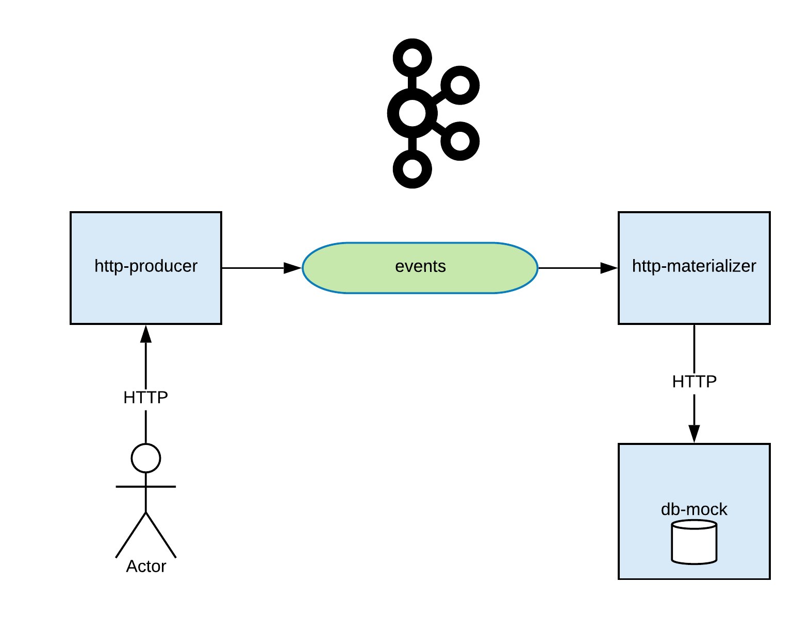

# Data pipeline
Example of data pipeline.



## cmds
```
# list topics
docker-compose exec kafka kafka-topics --list --zookeeper zookeeper:2181

# create a topic
docker-compose exec kafka kafka-topics --create --zookeeper zookeeper:2181 --replication-factor 1 --partitions 1 --topic events-message-v1
```